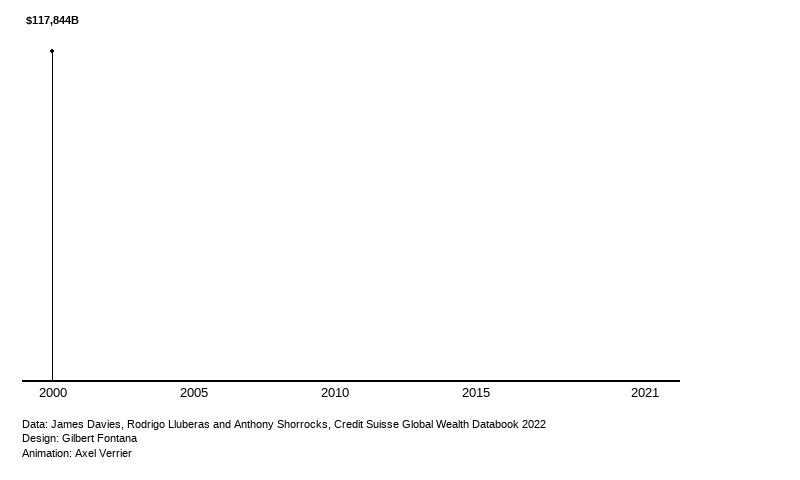

In this post, I reproduce a graph but making an animation out of it using the package `gganimate`.
The graph I use is from [Gilbert Fontana](https://twitter.com/GilbertFontana/status/1681734005668888601) whose code is available [here](https://r-graph-gallery.com/web-stacked-area-chart-inline-labels.html).

I made some minor adjustment for it to work with gganimate, and added the animation part. 

First, let's load the packages
```{r eval=FALSE}
#| label: Loading packages
library(tidyverse)
library(ggtext)
library(openxlsx)
library(gganimate)
```

Then I load the data. 
```{r eval=FALSE}
#| label: Loading the data
data = openxlsx::read.xlsx("https://github.com/holtzy/R-graph-gallery/raw/master/DATA/wealth_data.xlsx",sheet=1)
```

Some minor preparation details. 
```{r eval=FALSE}
#color palette
pal=c("#003f5c",
      "#2f4b7c",
      "#665191",
      "#a05195",
      "#d45087",
      "#f95d6a",
      "#ff7c43",
      "#ffa600")

# Stacking order
order <- c("United States", "China", "Japan", "Germany", "United Kingdom", "France", "India", "Other")

theme_set(theme_minimal(base_size = 3))

```

And finally, the plot, in which I incorporated a gganimate element : `transition_reveal()`

```{r eval=FALSE}
#| label: the plot
plot <- data %>%
  mutate(country = factor(country, levels=order)) %>% 
  ggplot(aes(year, total_wealth, fill = country, label = country, color = country)) +
  geom_area() +
  gganimate::transition_reveal(after_stat(x))+
  view_follow(fixed_x = TRUE) +
  
  #Title
  annotate("text", x = 2000, y = 100000,
           label = "Aggregated\nHousehold\nWealth",
           hjust=0,
           vjust=-1.9,
           size=12,
           lineheight=.9,
           fontface="bold",
           color="black") +

  #USA
  annotate("text", x = 2021.2, y = 370000,
           label = "USA $145,793B",
           hjust=0,
           size=3,
           lineheight=.8,
           fontface="bold",
           color=pal[1]) +
  #China
  annotate("text", x = 2021.2, y = 270000,
           label = "China $85,107B",
           hjust=0,
           size=3,
           lineheight=.8,
           fontface="bold",
           color=pal[2]) +
  #Japan
  annotate("text", x = 2021.2, y = 225000,
           label = "Japan $25,692B",
           hjust=0,
           size=3,
           lineheight=.8,
           fontface="bold",
           color=pal[3]) +
  #Germany
  annotate("text", x = 2021.2, y = 200000,
           label = "Germany $17,489B",
           hjust=0,
           size=3,
           lineheight=.8,
           fontface="bold",
           color=pal[4]) +
  #UK
  annotate("text", x = 2021.2, y = 180000,
           label = "UK $16,261B",
           hjust=0,
           size=3,
           lineheight=.8,
           fontface="bold",
           color=pal[5]) +
  #France
  annotate("text", x = 2021.2, y = 166000,
           label = "France $16,159B",
           hjust=0,
           size=3,
           lineheight=.8,
           fontface="bold",
           color=pal[6]) +
  #India
  annotate("text", x = 2021.2, y = 150000,
           label = "India $14,225B",
           hjust=0,
           size=3,
           lineheight=.8,
           fontface="bold",
           color=pal[7]) +
  #Other
  annotate("text", x = 2021.2, y = 80000,
           label = "Rest of the world\n$142,841B",
           hjust=0,
           size=3,
           lineheight=1.5,
           fontface="bold",
           color=pal[8]) +
  
  ## Vertical segments
  geom_segment(aes(x = 2000, y = 0, xend = 2000, yend = 117426+20000),color="black") +
  geom_point(aes(x = 2000, y = 117426+20000),color="black") +
  annotate("text", x = 2000, y = 117426+33000,
           label = "$117,844B",
           hjust=0.5,
           size=3,
           lineheight=.8,
           fontface="bold",
           color="black") +
  
  geom_segment(aes(x = 2005, y = 0, xend = 2005, yend = 181731+20000),color="black") +
  geom_point(aes(x = 2005, y = 181731+20000),color="black") +
  annotate("text", x = 2005, y = 181731+33000,
           label = "$182,350B",
           hjust=0.5,
           size=3,
           lineheight=.8,
           fontface="bold",
           color="black") +
  
  geom_segment(aes(x = 2010, y = 0, xend = 2010, yend = 250932+20000),color="black") +
  geom_point(aes(x = 2010, y = 250932+20000),color="black") +
  annotate("text", x = 2010, y = 250932+33000,
           label = "$251,885B",
           hjust=0.5,
           size=3,
           lineheight=.8,
           fontface="bold",
           color="black") +
  
  geom_segment(aes(x = 2015, y = 0, xend = 2015, yend = 296203+25000),color="black") +
  geom_point(aes(x = 2015, y = 296203+25000),color="black") +
  annotate("text", x = 2015, y = 296203+38000,
           label = "$297,698B",
           hjust=0.5,
           size=3,
           lineheight=.8,
           fontface="bold",
           color="black") +
  
  geom_segment(aes(x = 2021, y = 0, xend = 2021, yend = 461370+50000),color="black") +
  geom_point(aes(x = 2021, y = 461370+50000),color="black") +
  annotate("text", x = 2021, y = 461370+50000,
           label = "$463,567B",
           hjust=1.1,
           size=3,
           lineheight=.8,
           fontface="bold",
           color="black") +
  
  #Color scale
  scale_fill_manual(values=pal) +
  scale_color_manual(values=pal) +
  scale_x_continuous(breaks=c(2000,2005,2010,2015,2021),labels = c("2000","2005","2010","2015","2021")) +
  scale_y_continuous(expand = c(0,0)) +
  
  #Last customization
  coord_cartesian(clip = "off") +
  xlab("") +
  ylab("") +
  labs(caption = "Data: James Davies, Rodrigo Lluberas and Anthony Shorrocks, Credit Suisse Global Wealth Databook 2022
       Design: Gilbert Fontana
       Animation: Axel Verrier") +
  theme(
    axis.line.x = element_line(linewidth = .75),
    panel.grid = element_blank(),
    axis.text.y=element_blank(),
    axis.text.x = element_text(color="black", size=10,margin = margin(5,0,0,0)),
    plot.margin = margin(20,120,20,20),
    legend.position = "none",
    plot.caption =element_text(hjust=0, margin=margin(50,0,0,0), size = 8, lineheight = 1.5)
  )

```

Finally, the plot is transformed into a gif and saved. 

```{r eval=FALSE}

animate(plot,
        fps = 10,
        duration = 20,
        width=800, 
        end_pause = 80, 
        renderer = gifski_renderer()) 


anim_save(paste0(getwd(), "/projects/2024-oecd-r-workshop/wealth.gif"),
          animation = last_animation())

```


